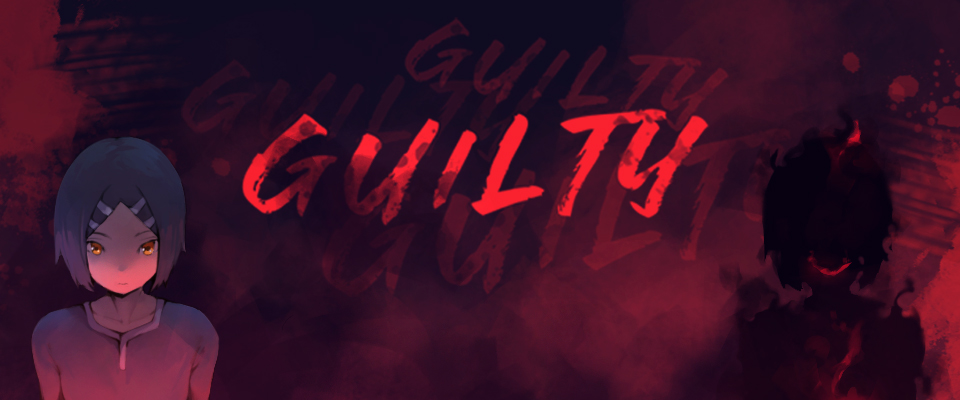

# Guilty - Takiko's Nightmare Press Kit

## Press info

We are happy that you are interested in featuring the game on your site. This page should help give you some details, information, and assets, that help you make the best content possible. Let us know if there is anything we can help you with.

You are welcome to use any of the assets that you can find on our website. We would recommend checking out our artwork and screenshot sections.

## Press Kit

We have prepared a single archive for download containing all you may use for press purposes. [You can download the Press Kit here](https://github.com/theflavare/guilty-takiko-s-nightmare-press-kit/releases/tag/latest).

## Demo Gameplay & Trailer

- Demo Preview: https://www.youtube.com/watch?v=CJgtvoHCReY
  

- Demo Preview - Puzzle Variation: https://www.youtube.com/watch?v=_0QeQP3jo_E
  

- Demo Full Walkthrough: https://www.youtube.com/watch?v=M_MAU0Vu1JU
  

## General Overview

Guilty - Takiko's Nightmare is a singleplayer story-based game. Play as Takiko to explore several areas inside her unique reality. Players can interact with various objects, solve puzzles, fighting enemies or discover some unreal phenomena.

Guilty - Takiko's Nightmare Game will available on Windows & MacOS PC via Steam & Itch.io, Google Play (TBC).

### Story

Takiko is a teenage girl. Her grades suddenly drop and sometimes she spends time in her room with empty looks.

The parents are getting worried about what is wrong with her. They decided to bring Takiko to a psychiatrist.

The psychiatrist took action by doing hypnotherapy to make Takiko relax and close her eyes. But, everything change after she open her eyes.

### Demo Features

- Story Chapter 1
- 5 Multiple Bad Ending

## Factsheet

- Game Title: Guilty - Takiko's Nightmare
- Developer / Creator / Copyright: The Flavare
- Platforms: Windows, MacOS (Steam), Android (TBC)
- Genre: 2D Platformer / Puzzle / Adventure
- Release Date: 30 Sept 2023 (Demo - Itch.io), 2025 (Release - Steam TBC)
- Mode: Singleplayer

### Other Facts

- Perspective: 2D
- Art Style: 2D Pixel-art
- Game Engine: Unity Engine
- Related / Inspiration games: Corpse Party, Lone Survivor
- Free Demo: Story Chapter 1
- Language: English, Indonesia & Japanese
- Price: (TBA)
- Created At: 2024-07-12
- Updated At: 2024-07-12

## Contact

For all press enquiries you can contact us at via Email.

- Email: hello@theflavare.com

## The Creator

You can find out about us in https://theflavare.com/about

## Assets / Resources

- Website: https://theflavare.com
- X / Twitter: https://x.com/TheFlavare
- IG: https://instagram.com/theflavare

You can use all resources relate to game for publication

- [Logo](https://github.com/theflavare/guilty-takiko-s-nightmare-press-kit/tree/main/logo): https://github.com/theflavare/guilty-takiko-s-nightmare-press-kit/tree/main/logo
- [Screenshot](https://github.com/theflavare/guilty-takiko-s-nightmare-press-kit/tree/main/screenshot): https://github.com/theflavare/guilty-takiko-s-nightmare-press-kit/tree/main/screenshot
- [Artwork](https://github.com/theflavare/guilty-takiko-s-nightmare-press-kit/tree/main/artwork): https://github.com/theflavare/guilty-takiko-s-nightmare-press-kit/tree/main/artwork
